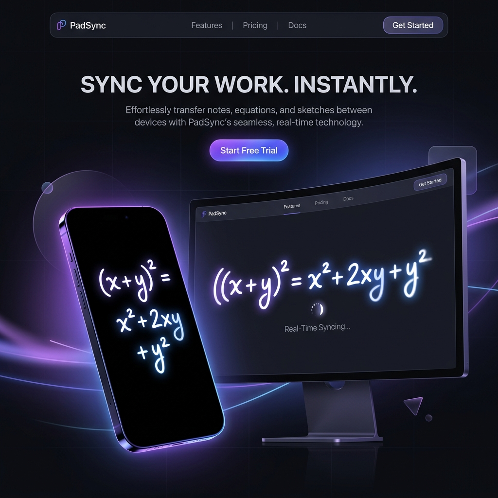

# 🖋️ PadSync

**PadSync** is a lightweight, real-time tool that turns your smartphone into a wireless writing pad for your Windows PC. No expensive hardware, no dedicated stylus required—just your phone and a WiFi connection.



## ✨ Features

- **📱 Phone-to-PC Sync:** Use your mobile browser to draw or write and see it rendered instantly on your desktop.
- **⚡ Zero Latency:** Optimized with Socket.io for a near-instant, lag-free experience.
- **🔒 Privacy First:** Your strokes are relayed through a local network or a private signaling server. No cloud storage, no accounts.
- **🎨 Rich Canvas:** Built on top of the powerful `Tldraw` engine for smooth strokes and intuitive tools.
- **📦 Multi-Platform:**
  - **Phone:** Installable PWA (Progressive Web App).
  - **Desktop:** Native Windows Electron application.

## 🚀 How it Works

1. **Launch** the PadSync Desktop app on your Windows PC.
2. **Scan** the generated QR code or enter the 6-digit room code on your phone.
3. **Write** or doodle on your phone screen—the strokes appear live on your laptop canvas.

## 🛠️ Tech Stack

- **Monorepo:** `pnpm` Workspaces
- **Frontend (Phone):** React (Vite) + TailwindCSS + Tldraw
- **Desktop:** Electron.js + React + Tldraw
- **Server:** Node.js + Express + Socket.io
- **Landing Page:** Astro.js

## 📂 Project Structure

```text
padsync/
├── apps/
│   ├── phone-pwa/       # Mobile drawing surface (React)
│   ├── desktop/         # Windows receiver app (Electron)
│   ├── server/          # Signaling server (Socket.io)
│   └── landing/         # Marketing site (Astro)
├── packages/
│   └── shared/          # Shared TS types and event constants
└── packages.json        # Monorepo root configuration
```

## 🛠️ Getting Started

### Prerequisites
- [Node.js](https://nodejs.org/) (v18 or higher)
- [pnpm](https://pnpm.io/)

### Installation
```bash
# Clone the repository
git clone https://github.com/YOUR_USERNAME/padsync.git

# Install dependencies
pnpm install
```

### Development
You can run all services simultaneously using the root command:
```bash
pnpm dev
```

Or run individual apps:
```bash
# Run server only
pnpm --filter server dev

# Run phone app only
pnpm --filter phone-pwa dev

# Run desktop app (Electron)
pnpm --filter desktop dev:all
```

## 📜 Design Guidelines
PadSync follows a **"Soft, Premium, Focused"** aesthetic.
- **Theme:** Lavender Light (#EEF0F8)
- **Primary Color:** Iris Purple (#7B7FD4)
- **Typography:** Inter

## 🗺️ Roadmap
- [x] Phase 1-5: Core Real-time Drawing & Pairing
- [x] Phase 6: Astro Landing Page
- [ ] Phase 7: macOS Support
- [ ] Phase 8: Multiple input surfaces

## 🤝 Contributing
Contributions are welcome! Please read the `instruction.md` for our modular architecture rules and `designguideline.md` for UI standards before submitting a PR.

## 📄 License
MIT © PadSync

---
*Built for speed, built for flow.*
